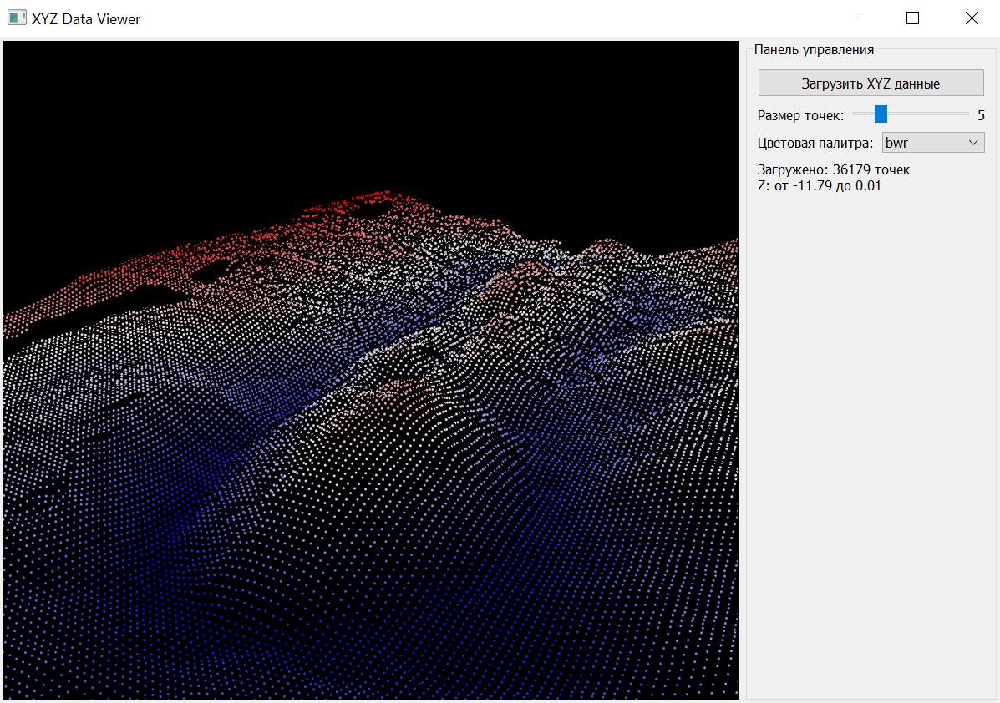

# *XYZ Data Viewer*

---

Простое настольное приложение для визуализации трёхмерных данных в формате XYZ (X, Y, Z). Позволяет загружать текстовые файлы с координатами точек и отображать их в интерактивном 3D-окне с возможностью настройки цветовой палитры и размера точек.



---

## Возможности

- Загрузка данных из `.txt`, `.csv`, `.dat` файлов (разделители: пробелы или запятые)
- Интерактивное 3D-отображение точек с помощью **vispy**
- Цветовая кодировка по значению Z (глубина/высота)
- Выбор из нескольких встроенных цветовых палитр
- Регулировка размера точек
- Автоматическая настройка камеры под диапазон данных
- Простой и интуитивный интерфейс на **PyQt5**

---

## 📂 Формат данных

Файл должен содержать **минимум три числовые колонки**:  
`X Y Z` — разделённые пробелами, табуляцией или запятыми.

Пример (`data.txt`):
```
10.5 20.3 -5.2
11.0 21.1 -4.8
12.3 19.9 -6.1
```

---

## Автор

© 2025 [**alexsevas**](https://github.com/alexsevas)
