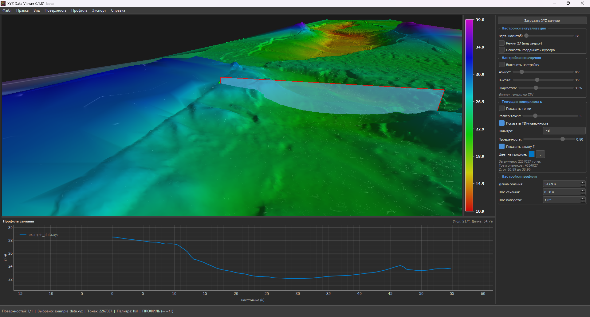
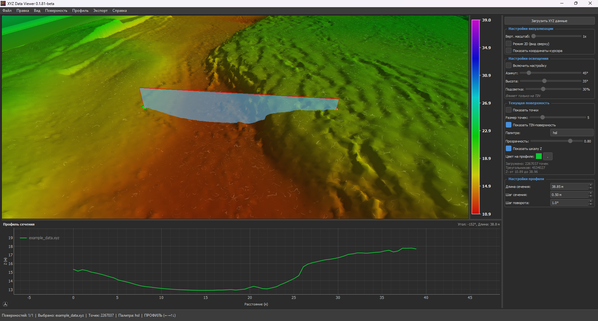

# XYZ Data Viewer


**Программа для визуализации и анализа гидрографических данных**

---

## 📸 Скриншоты

### Главное окно программы


### Работа с профилями сечений


---

## 📥 Скачать

Перейдите в раздел [**Releases**](../../releases) для скачивания последней версии.

**Последняя версия:** [XYZ Data Viewer 0.1.81-beta](../../releases/tag/v0.1.81-beta)

---

## ✨ Основные возможности

### 🌊 Визуализация 3D данных
- **Загрузка облаков точек** из форматов: `.xyz`, `.txt`, `.csv`, `.pts`, `.dat`
- **Интерактивная 3D-визуализация** с использованием OpenGL
- **Два режима отображения:**
  - 🔵 Точки (Point Cloud)
  - 🔺 Триангуляция Делоне (TIN - Triangulated Irregular Network)
- **27 цветовых палитр** для отображения высот с плавными градиентами
- **Настройка отображения:**
  - Размер точек (1-20)
  - Прозрачность (0-100%)
  - Вертикальный масштаб (1x-20x, только целые числа)
- **Работа с несколькими поверхностями** одновременно

### 📊 Профили сечений
- **Интерактивное создание профилей** - два клика мышью на плане
- **Визуализация сечения в 3D:**
  - Красная рамка границ сечения
  - Голубая полупрозрачная заливка (curtain)
  - Динамическая синхронизация с окном профиля
- **Окно профиля:**
  - Отображение профилей нескольких поверхностей одновременно
  - Zoom и pan с мгновенным обновлением рамки в 3D
  - Настраиваемые цвета для каждой поверхности
  - Сетка с координатами
- **Управление сечением клавишами:**
  - `←` `→` - смещение вдоль линии
  - `↑` `↓` - смещение перпендикулярно линии
  - `Page Up` `Page Down` - поворот сечения
  - `Home` - сброс к исходному положению
- **Экспорт профилей:**
  - В формат **DXF** (AutoCAD)
  - С сеткой координат и подписями
  - Настраиваемые параметры экспорта

### 🛤️ Работа с трассами
- **Загрузка трасс** из текстовых файлов (формат: X, Y на каждой строке)
- **Автоматический расчет:**
  - Длина трассы
  - Пикетаж с заданным шагом
  - Координаты пикетов
- **Настройки трассы:**
  - Референсная точка (начало отсчета)
  - Шаг пикетажа (метры)
  - Цвет отображения
  - Видимость пикетных меток
- **Визуализация в 3D:**
  - Линия трассы с учетом рельефа
  - Подписи пикетов (PK 0, PK 100, PK 200...)
  - Вертикальные маркеры на каждом пикете
- **Редактор трассы** - удобный диалог для настройки параметров

### 📐 Импорт DXF
- **Импорт 3D объектов** из файлов AutoCAD DXF
- **Поддерживаемые примитивы:**
  - `3DFACE` - 3D грани
  - `LINE` - линии
  - `LWPOLYLINE` - полилинии
  - `POLYLINE` - полилинии с высотой
- **Автоматическое извлечение** Z-координат
- **Отображение в 3D** вместе с поверхностями

### 💾 Проекты
- **Сохранение проектов** в формате `.xdv` (XYZ Data Viewer)
- **Сохраняется всё:**
  - Все загруженные поверхности
  - Пути к исходным файлам
  - Настройки отображения (палитры, прозрачность, масштаб)
  - Трассы с настройками
  - Импортированные DXF
  - Положение камеры
  - Состояние профилей
- **Автосохранение** - автоматическое сохранение при изменениях
- **Обработка отсутствующих файлов** при открытии проекта

### 🎨 Интерфейс
- **Панель проекта**:
  - Древовидная структура объектов
  - Иконки для каждого типа объектов
  - Контекстное меню (ПКМ)
  - Чекбоксы видимости
- **Панель свойств:**
  - Детальная информация о выбранном объекте
  - Редактирование параметров на лету
  - Статистика (количество точек, треугольников, размер)
- **Цветовая шкала (ColorBar):**
  - Отображение диапазона высот
  - Минимальная/максимальная отметка
  - Градиент текущей палитры
  - Автоматическое обновление при смене поверхности
- **Темы оформления:**
  - 🌞 Светлая тема
  - 🌙 Темная тема
- **Splash Screen** при запуске

### 🚀 Производительность
- **Многопоточная обработка:**
  - Загрузка данных в фоновом режиме
  - Расчет профилей без блокировки UI
  - Обновление визуализации в отдельном потоке
- **Оптимизация расчетов:**
  - KD-дерево для быстрого поиска точек
  - Триангуляция Делоне (SciPy)
  - Кэширование вычислений
- **Precomputation режимы** (экспериментально):
  - Регулярная сетка Z - максимальная скорость
  - Прогрев кэшей - минимальная память
- **Поддержка больших данных:**
  - Оптимизация для файлов до 500 MB
  - Эффективная работа с миллионами точек
 
### 🔄 Система автоматических обновлений (новое в 0.1.82-beta)
- **Проверка обновлений** через GitHub Releases API
- **Меню:** Справка → Проверка обновлений
- **Автоматическое определение** новой версии
- **Диалог с информацией:**
  - Номер новой версии
  - Описание изменений (changelog)
  - Размер файла installer
  - Дата публикации
- **Загрузка и установка:**
  - Автоматическая загрузка installer
  - Прогресс-бар загрузки
  - Запуск установки в один клик
  - Автоматическое закрытие программы перед обновлением
- **Поддержка pre-release версий** (beta, alpha)
- **Безопасность:**
  - Проверка подлинности через HTTPS
  - Официальный GitHub репозиторий
  - Контроль целостности файлов

### 📤 Экспорт
- **Изображения:**
  - PNG, JPEG, BMP
  - Настраиваемое разрешение
  - Текущий вид 3D сцены
- **DXF профили:**
  - С координатной сеткой
  - С подписями осей
  - Масштабируемые параметры
- **Облака точек:**
  - Экспорт в XYZ формат
  - Сохранение исходных координат

### ⌨️ Горячие клавиши

#### Навигация камеры
- `W` `A` `S` `D` - перемещение камеры
- `Q` `E` - вращение вокруг оси Z
- `R` `F` - подъем/опускание камеры
- `Пробел` - автоматическая настройка камеры
- `Ctrl + R` - сброс камеры

#### Профили
- `Escape` - отмена создания/закрытие профиля
- `Delete` - удалить активный профиль
- `←` `→` `↑` `↓` - смещение сечения
- `Page Up` `Page Down` - поворот сечения
- `Home` - сброс положения сечения

#### Общие
- `Ctrl + O` - открыть файл
- `Ctrl + S` - сохранить проект
- `Ctrl + Shift + S` - сохранить как
- `Ctrl + W` - закрыть активную поверхность
- `F11` - полноэкранный режим

---

## 💻 Системные требования

### Минимальные
- **ОС:** Windows 10 (64-bit)
- **Процессор:** Intel Core i3 или аналог
- **RAM:** 4 GB
- **Видеокарта:** С поддержкой OpenGL 2.1+
- **Место на диске:** 200 MB

### Рекомендуемые
- **ОС:** Windows 11 (64-bit)
- **Процессор:** Intel Core i5 или выше
- **RAM:** 8 GB или больше
- **Видеокарта:** Дискретная с поддержкой OpenGL 3.3+
- **Место на диске:** 500 MB

---

## 📦 Установка

1. Скачайте последний **installer** из раздела [Releases](../../releases)
2. Запустите файл `XYZ_DataViewer_Setup_0.1.81-beta.exe`
3. Следуйте инструкциям установщика
4. Запустите программу из меню "Пуск" или с рабочего стола

---

## 🎯 Быстрый старт

### 1. Загрузка данных
- **Файл** → **Открыть XYZ файл** (или `Ctrl+O`)
- Выберите файл с данными (`.xyz`, `.txt`, `.csv`, `.pts`, `.dat`)
- Дождитесь окончания загрузки (прогресс-бар внизу)

### 2. Настройка отображения
- В панели **свойств** (справа) измените:
  - **Палитру** - выберите из 27 доступных
  - **Режим** - Точки или Триангуляция
  - **Прозрачность** - для просвечивания
  - **Вертикальный масштаб** - для лучшей визуализации рельефа

### 3. Создание профиля
- Нажмите кнопку **"Профиль"** на панели инструментов
- Кликните **два раза** мышью на плане (начало и конец линии)
- Откроется окно с графиком профиля
- Используйте **zoom** (колесико) и **pan** (левая кнопка) для детального просмотра

### 4. Сохранение проекта
- **Файл** → **Сохранить проект** (`Ctrl+S`)
- Выберите место и имя файла (`.xdv`)
- Все настройки и объекты будут сохранены

---

## 📋 Поддерживаемые форматы данных

### Входные форматы

#### XYZ файлы
```
# Формат: X Y Z (разделители: пробел, табуляция или запятая)
100.00 200.00 10.50
100.50 200.00 10.55
101.00 200.00 10.60
...
```

**Поддерживаемые расширения:** `.xyz`, `.txt`, `.csv`, `.pts`, `.dat`

**Особенности:**
- Автоматическое определение разделителя
- Игнорирование заголовков и комментариев (строки начинающиеся с `#`)
- Поддержка различных форматов чисел (точка/запятая как десятичный разделитель)

#### Трассы
```
# Формат: X Y (по одной точке на строке)
1000.00 2000.00
1010.50 2005.30
1020.80 2010.50
...
```

**Требования:**
- Только координаты X и Y
- Точки должны идти последовательно вдоль трассы

#### DXF файлы
- Стандарт: AutoCAD DXF R12 и выше
- Примитивы: `3DFACE`, `LINE`, `LWPOLYLINE`, `POLYLINE`
- Координаты: 3D (X, Y, Z)

### Выходные форматы

#### Проекты
- **Формат:** `.xdv` (JSON-based)
- **Содержит:** Все настройки, пути к файлам, состояние проекта

#### Экспорт
- **Изображения:** PNG, JPEG, BMP
- **DXF:** Профили с координатной сеткой
- **XYZ:** Облака точек

---

## 🐛 Известные ограничения

### Текущая версия (0.1.81-beta)

1. **Precomputation режимы** - работают нестабильно, требуют доработки
2. **Размер файлов** - файлы >500MB могут загружаться медленно
3. **Производительность** - при >1 млн точек возможны лаги на слабом железе
4. **DXF импорт** - поддерживаются только базовые примитивы

### Планируется исправить

- Оптимизация работы с большими файлами
- Улучшение производительности триангуляции
- Расширение поддержки DXF примитивов
- Добавление новых форматов данных

---

## 🔄 История версий

### 0.1.81-beta (20.09.2026)

#### 🔧 Изменения
- Вертикальный масштаб теперь только целые числа (1x-20x)
- Улучшен дизайн Splash Screen - зеленые цвета в стиле "Матрица"

#### 🐛 Исправления
- Рамка сечения привязана к границам Z профиля
- Curtain (голубая заливка) синхронизирована с рамкой
- Исправлены критические ошибки загрузки поверхностей из проектов

#### ✨ Улучшения
- Организована структура тестов
- Обновлена документация
- Улучшена стабильность работы

### 0.1.80-beta (31.08.2026)
- Добавлен Splash Screen при запуске
- Продлена лицензия до 01.01.2027
- Исправлена ошибка загрузки проектов
- Динамическое обновление рамки профиля при zoom

### Предыдущие версии
См. полный [CHANGELOG.md](../docs/CHANGELOG.md)

---

## 📧 Контакты и поддержка

**Разработчик:** Александр Отроков  
**Email:** a1exsevas@yandex.ru  
**GitHub:** [alexsevas](https://github.com/alexsevas)

### Обратная связь

Если вы обнаружили ошибку или у вас есть предложение по улучшению:
1. Отправьте email на **a1exsevas@yandex.ru**
2. Опишите проблему или идею максимально подробно
3. Приложите скриншоты (если применимо)

### Сообщить об ошибке

При обращении укажите:
- **Версию программы** (Справка → О программе)
- **Операционную систему** и её версию
- **Шаги для воспроизведения** ошибки
- **Сообщение об ошибке** (если есть)
- **Размер и формат** файла данных (если проблема с загрузкой)

---

## 📝 Лицензия

**Proprietary Software**

Пробная версия программы.  
**Лицензия действует до:** 01.01.2027

После истечения срока действия лицензии потребуется обновление для продолжения использования.

---

## Благодарности

Спасибо всем пользователям за отзывы и предложения по улучшению программы!

---

## Планы развития

### В разработке

- ✅ Система автоматических обновлений (в процессе)
- 🔄 Оптимизация работы с большими файлами
- 🔄 Поддержка форматов LAS/LAZ (лазерное сканирование)
- 🔄 Расширенные инструменты анализа рельефа

### Планируется

- Экспорт в 3D форматы (OBJ, STL)
- Измерительные инструменты (расстояния, площади, объёмы)
- Аннотации и подписи на плане
- Интеграция с ГИС системами
- Поддержка координатных систем и проекций

Следите за обновлениями в разделе [Releases](../../releases)!

---

<div align="center">

**[⬆ Наверх](#xyz-data-viewer)**

---

© 2026 XYZ Data Viewer, Made by [Александр Отроков](mailto:a1exsevas@yandex.ru)

</div>
